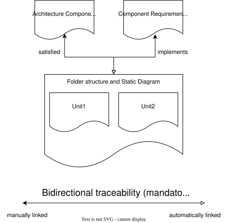
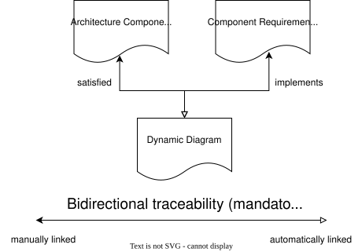
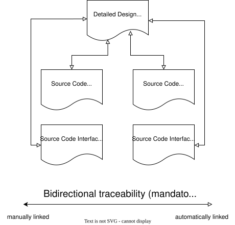

..
   # *******************************************************************************
   # Copyright (c) 2025 Contributors to the Eclipse Foundation
   #
   # See the NOTICE file(s) distributed with this work for additional
   # information regarding copyright ownership.
   #
   # This program and the accompanying materials are made available under the
   # terms of the Apache License Version 2.0 which is available at
   # https://www.apache.org/licenses/LICENSE-2.0
   #
   # SPDX-License-Identifier: Apache-2.0
   # *******************************************************************************

Guideline
#########

.. gd_guidl:: Implementation Guideline
   :id: gd_guidl__implementation
   :status: valid
   :version: 2
   :complies: std_req__iso26262__software_744[version==1],
              std_req__iso26262__software_841[version==1],
              std_req__iso26262__software_842[version==1],
              std_req__iso26262__software_843[version==1],
              std_req__iso26262__software_844[version==1],
              std_req__iso26262__software_845[version==1],
              std_req__aspice_40__SWE-3-BP1[version==1],
              std_req__aspice_40__SWE-3-BP2[version==1],
              std_req__aspice_40__SWE-3-BP3[version==1],
              std_req__aspice_40__SWE-3-BP4[version==1],
              std_req__aspice_40__iic-11-05[version==1]

This document describes the general guidance for implementation based on the concept which is defined :need:`[[title]]<doc_concept__imp_concept>`.
An example of a Detailed Design is maintained in the
`module template documentation <https://eclipse-score.github.io/module_template/main/components/component_example/detailed_design/detailed_design_example.html>`_.

**Scope:** This guideline applies to both QM (Quality Management) and ASIL B components. Where specific requirements differ between QM and ASIL B (e.g., complexity thresholds, design principles), they are explicitly noted.

Workflow for Implementation
===========================

Detailed description which steps are need for implementation.

#. Consult which programming languages, design/coding guidelines and tools are used for Software
   development according the rules given in the project specific :need:`SW development Plan <wp__sw_development_plan>`.
#. Create a Detailed Design. Based on the :need:`Component Requirements <wp__requirements_comp>`
   and the :need:`Component Architecture <wp__component_arch>`, the component is broken down into
   smaller, independent units that can be tested separately during the unit testing phase.
   A detailed design shall exist for every unit. It is captured primarily in the source code
   itself (unit interfaces and contracts, e.g. public API headers, trait or function signatures,
   and source code comments). A separate detailed design document following the template
   :need:`gd_temp__detailed_design` including static and dynamic views is **optional** and is
   only created where it helps to explain complex components or a large number of unit
   interactions (see :need:`doc_concept__imp_concept`). The detailed design shall be so exact,
   that test and implementation can be run simultaneously.
#. Document and justify the detailed design decisions, in particular those that shape the
   decomposition of the component into units. The rationale shall be captured close to the design,
   i.e. in the source and header files (e.g. as doxygen-style comments) and, where applicable, in the
   detailed design documentation (see :need:`doc_concept__imp_concept`).
#. Implement the source code, by using the coding guidelines given within the project specific :need:`SW development Plan <wp__sw_development_plan>` for the programming languages in your project.
#. Create a pull request for your change.
#. Detail Design and Code Inspection is done to review the code of the software and detect errors in it. See the detailed design and code :need:`inspection checklist <doc__feature_name_req_inspection>` for evaluation criteria.
#. Check the results of the static and dynamic code analysis (this includes compiler warnings). Acceptance criteria are defined in the Verification Plan :need:`gd_temp__verification_plan`.
#. Fix or justify the errors.
#. Merge the pull request.
#. Create a follow up ticket if not all findings could be fixed.


Basis for Unit Testing
======================

The basis (test oracle) for unit testing is the **detailed design of the unit**, i.e. the
unit's specified interfaces and behaviour as documented in the source code (public API
headers, trait or function signatures and their contracts). The source code is the object
under test, not the reference against which it is tested.

Requirements are owned by the **component**, not by individual units, and there is no
formal allocation of requirements to units. The component requirements are distributed
across the units implicitly by the detailed design, and they are verified collectively by
the units and primarily by the component integration tests (see :need:`wp__component_arch`
and the verification process area). Separate requirements at unit granularity are therefore
**not** required.

Unit tests thus verify the detailed design of the unit. Only in the exceptional case where
a single unit fully realises a component requirement may the corresponding unit test cover
and link to that component requirement directly.

Traceability
============

The traceability of a component to its units is achieved primarily through naming
conventions: the decomposition of a component into its units is mainly described by the
directory and file name structure. Each component (and sub-component) maps to a namespace
and thus to a directory, its units are represented by the corresponding source and header
files within that directory, and sub-components are reflected by nested sub-directories so
that the folder hierarchy mirrors the decomposition of the component into sub-components
and units. Units therefore belong to their component and inherit the accordance to the
architecture from their location (see :need:`doc_concept__imp_concept`). Unit tests and
the detailed design are implicitly related by file naming and header inclusion, so no
additional explicit linking is required for these.

A static and a dynamic view for unit interactions are optional and are only added when
they help to explain complex components or a large number of unit interactions. If such
diagrams are provided, they are linked to the architecture and the component requirements
as shown below.

Traceability from requirements to units is established implicitly through the verification work products:
:need:`unit tests <wf__verification_unit_test>` and :need:`component integration tests <wf__verification_comp_int_test>` reference specific requirement IDs and exercise
the units that implement those requirements. This creates the necessary requirement-to-unit link for compliance
and audit purposes. See the :ref:`verification process area <process_verification>` for details on how requirements
are verified through tests that exercise specific units.



If used, the static diagram satisfies the architecture and implements the requirements of the related component. The static diagram includes Unit1+2.




If used, the dynamic diagram satisfies the architecture and implements the requirements of the related component.



The unit description is provided by the interface documentation and the comments in the source code itself.

Detailed Design Guidance
========================

Definition of a Unit
--------------------

A **unit** is a **granular, independent entity** of a component that can be **tested separately**
during the unit testing phase. Each unit represents a **self-contained functionality** and is
derived from the decomposition of a component.

**Characteristics of a Unit**

-  **Independent** - Can be tested in isolation.
-  **Granular** - Represents a small, well-defined part of the system.
-  **Relational** - Has associations with other units, defined using **UML 2.0 notations** such as
   aggregation, composition, and generalization.

**Examples:**
The definition of a unit depends on the used programming language. Examples for a unit are
a source file, a definition file (e.g. c++ header), classes, structs, and functions.
This list is not complete or exclusive.

**Units in UML Diagrams**

-  **C++ development** - Each **class** can be considered a **unit** in the design.
-  **Rust development** - A **unit** is modeled using a **combination of ``struct`` and ``trait``**,
   as Rust does not have traditional classes.

Units within the Component
--------------------------

The relationship between a unit and its parent component is established implicitly through the
**file path**: the decomposition of a component into its units is mainly described by the directory
and file name structure. Each component (and sub-component) has its own directory, its units are
represented by the corresponding source and header files within that directory, and sub-components
are reflected by nested sub-directories so that the folder hierarchy mirrors the decomposition of
the component into sub-components and units. Units therefore belong to their component and inherit
the accordance to the architecture from their location. A separate static diagram
per unit is **not required**; the unit's attributes and behaviour are documented in the source
code itself as the source code is sufficiently self-explanatory and adheres to the design principles outlined in the development plan.

This is sufficient for ASIL B compliance per :need:`ISO 26262-6 §8 <std_req__iso26262__software_841>`, as the structural decomposition
is evident from the directory layout and the component-level static view of the architecture already captures the
relevant unit relationships.

However, for components with complex interactions or a large number of units, a static view can be beneficial for understanding the overall structure and relationships between units. The developer may choose to add a additional unit-level static and dynamic view if they believe it helps to explain the source code better.

It is important that the naming of the units, their interfaces and functions in any diagrams or
descriptions matches the naming in the source code to ensure traceability. This means the diagrams
and descriptions should not be outdated, should stay consistent with the source code, and should not
introduce new terminology or concepts that are not present in the code.

Design Principles of the Units
``````````````````````````````

The unit design shall achieve quality attributes (like simplicity, modularity, and encapsulation) which shall be enforced through coding guidelines and static analysis tooling appropriate for the programming language in use (e.g. MISRA C for C/C++, Clippy lints for Rust) as specified in the project development plan to fulfill the guidelines :need:`ISO 26262-6 §8.4.5, Table 6 <std_req__iso26262__software_845>` and :need:`ASPICE SWE.3/SWE.4<std_req__aspice_40__SWE-3-BP3>` requirements.

For safety-related (ASIL) units, the design and coding principles for software unit design and
implementation of :need:`ISO 26262-6 §8.4.5, Table 6 <std_req__iso26262__software_845>` shall be
applied.

These principles are not enforced manually only: the project's coding guideline together with the
static and dynamic code analysis defined in the project development plan (e.g. MISRA C for C/C++,
Clippy lints for Rust) shall enforce them for ASIL units. For QM units the same activities apply,
whereas the ISO 26262 specific principles above are binding only for safety-related units.

The **source code** itself shall be self-documenting with meaningful naming and structure.
**Code comments** may be used where the logic is not self-evident and to give an rationale.
These comments, along with commit messages, and any additional documentation accompanying the
source code shall use natural language.

The interface documentation of a software unit is part of the source code (e.g. public API headers,
trait definitions, or documented function signatures). If interfaces of the units are also interfaces
of the component, they should follow the same documentation rules as the component interfaces
(see :need:`gd_guidl__arch_design`).

Especially for public interfaces, the interface naming should follow the naming of the logical
interface in the feature and component architecture to ensure traceability. The interface
documentation should be clear and comprehensive so users of the unit can understand how to interact
with it without needing to read implementation details. The documentation should be maintained and
updated as the implementation evolves.

Diagrams
--------

Developers may add optional diagrams at the unit level if they believe it helps to explain the
source code better. These are supplementary documentation and are not mandatory. Details are
described in the following sections.

Static View
```````````

If a static view is used, it should provide an overview of the **units** and their relationships
using **UML 2.0 notations**, such as **aggregation, composition, and generalization**. It is depicted
through **UML structural diagrams**, including:

-  **Class Diagrams** - Define classes, attributes, methods, and relationships (e.g. inheritance,
   associations, dependencies).
-  **Component Diagrams** - Show the organization and dependencies among software units, which can be
   used to represent the units within a component.
-  **Rust** - Uses ``struct`` and ``trait`` combinations to represent units in UML diagrams.

The static view need not cover every class or struct in the implementation - it should show the units
and relationships that are necessary to understand the detailed design.

The naming of the units and their interfaces in the static view should match the naming in the source
code to ensure traceability. Implementation details that are not relevant at the design level may be
omitted.

According to the software development plan of the project, the developer may use tools like PlantUML
or Draw.io for such diagrams.

Dynamic View
````````````

An optional **dynamic view** illustrates how the **units** within a component interact over their
**interfaces** to fulfill a specific **use case** or **functionality**. This is a **component-level**
view - individual per-unit dynamic diagrams are **not required**.

It is represented using **UML behavioural diagrams**, including:

-  **Sequence Diagrams** - Depict interactions between objects in a time-ordered sequence,
   highlighting how methods are invoked and how control flows between objects over time.
-  **State Machine Diagrams** - Show how the state of an object changes in response to events,
   allowing the modeling of complex state transitions (if there is stateful behaviour).

A dynamic view is optional when the component's behaviour is straightforward and can be understood
from the static view and interface documentation alone (similar to the rules depicted in
:need:`gd_guidl__arch_design`).

Example using PlantUML:

.. uml::

   @startuml
   participant UnitA
   participant UnitB

   UnitA -> UnitB : request()
   UnitB --> UnitA : response()
   @enduml

.. needextend:: "c.this_doc()"
   :+tags: implementation
