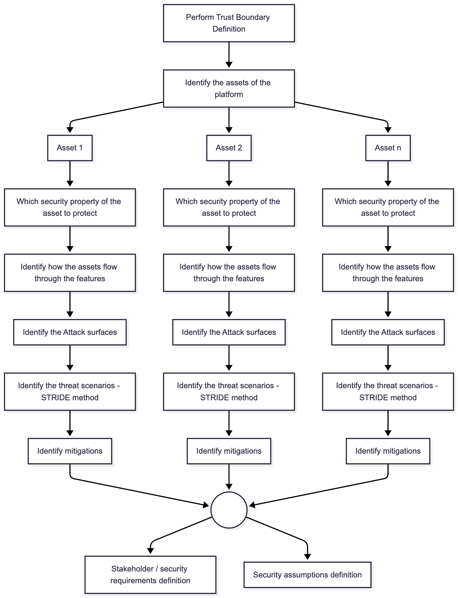
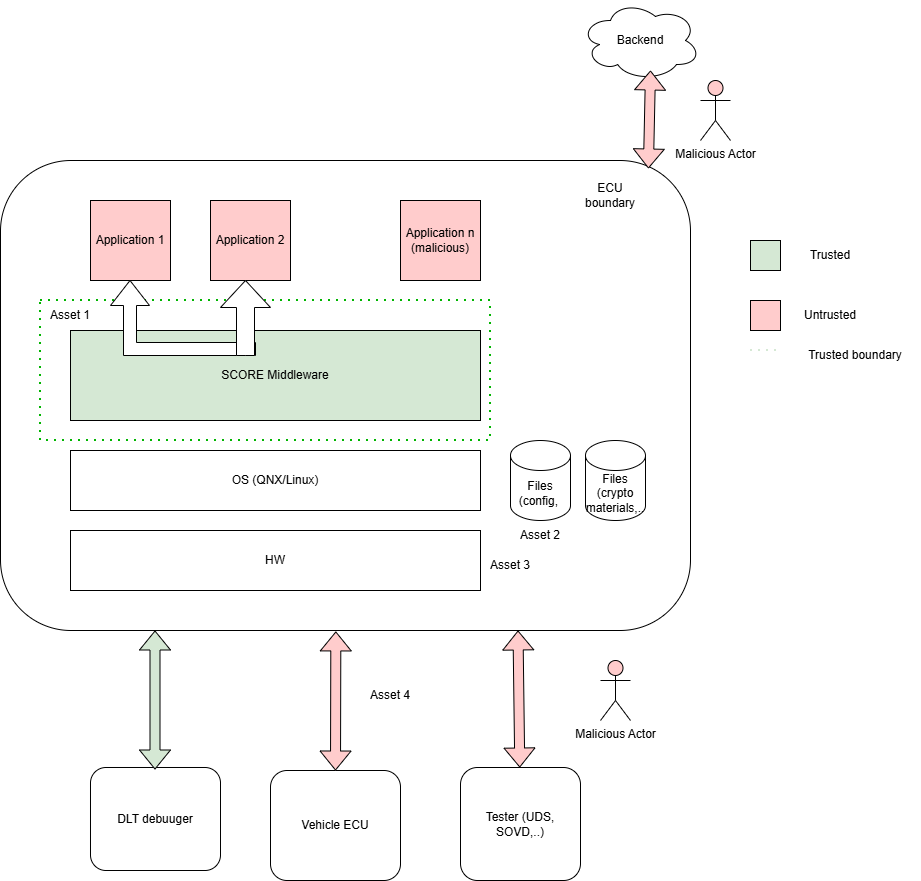

..
   # *******************************************************************************
   # Copyright (c) 2025 Contributors to the Eclipse Foundation
   #
   # See the NOTICE file(s) distributed with this work for additional
   # information regarding copyright ownership.
   #
   # This program and the accompanying materials are made available under the
   # terms of the Apache License Version 2.0 which is available at
   # https://www.apache.org/licenses/LICENSE-2.0
   #
   # SPDX-License-Identifier: Apache-2.0
   # *******************************************************************************

   # Some portions generated by Co-Pilot

Concept Description
###################

.. doc_concept:: Security Analysis Concept
   :id: doc_concept__security_analysis
   :status: valid
   :tags: security_analysis

This section discusses a concept for Security Analysis. Various methods can be used for Security Analysis (e.g. STRIDE).
This concept is based on the requirements of ISO/SAE 21434 Part 8 and Part 15.

The objective of the **Security Analysis** is to identify and analyze potential
cybersecurity threat scenarios, threats, and vulnerabilities. Security Analysis
identifies potential attack scenarios that could compromise the cybersecurity of the
defined elements.
How to perform a Security Analysis is described in :need:`gd_guidl__security_analysis`.
To have a structured Security Analysis, the threat scenarios have to be considered
:need:`gd_guidl__sec_ana_threat_scenarios`. These are separated into the following
categories:

 | - Attack surfaces threats: Interfaces and entry points that could be exploited by attackers.
 | - Communication threats: Threats related to data transmission, including interception, manipulation, or spoofing.
 | - Shared information inputs threats: Same input used by multiple functions that could be exploited.
 | - Unintended impacts threats: Security impacts due to various vulnerabilities such as privilege escalation or resource exhaustion.
 | - Development threats: Vulnerabilities introduced during the development process that may lead to security issues.

The objective of the **Security Analysis** is to show that the architecture created to
fulfill the requirements does not introduce possible vulnerabilities which would
break the security requirements (cybersecurity goals are top level security requirements).
Alternatively, it ensures that the possibility of these vulnerabilities is reduced to an acceptable
level. This can be achieved by mitigation actions (accept, avoid, reduce, share). The Security
Analysis is used to find possible threats and their effects. The possible threats are
systematically identified by applying threat models :need:`gd_guidl__threat_models_stride`.

The Security Analysis shall be performed once at platform level to analyze the attack
surfaces between the platform features.
Typically the Security Analysis shall be performed at feature level and component level.
If a component has no sub-components, the result of the analysis is the same as at
feature level. So no additional consideration is needed.
In this case please document this in the content of the document.

Inputs
******

#. Stakeholders for the Security Analysis?
#. Who needs which information?
#. How should the analysis be performed?
#. How should risks be mitigated?
#. What analysis shall be done in which level?

Stakeholders for the Security Analysis
======================================

#. :need:`Security Engineer <rl__security_engineer>`

   * Analyze all feature architectures together with Platform-Level Security Analysis
   * Analyze the feature architecture with the defined method
   * Analyze the component architecture with the defined method
   * Monitor and Verify the Security Analyses

#. :need:`Security Manager <rl__security_manager>`

   * Approve the Security Analysis
   * Approve the verification of the Security Analyses

#. :need:`Contributor <rl__contributor>`

   * Support the Security Analysis
   * Support the monitoring and verifying of the Security Analyses

#. :need:`Committer <rl__committer>`

   * Support the Security Analysis
   * Support the monitoring and verifying of the Security Analyses

#. :need:`Safety Manager <rl__safety_manager>`

   * Support the Security Analysis
   * Support the monitoring and verifying of the Security Analyses

Standard Requirements
=====================

Requirements from relevant standards must also be considered:

* ISO/SAE 21434
* ISO 26262

How to analyze?
===============

The Security Analysis are done on the platform, feature and component architecture.
The Security Analysis shall be done accompanying to the development.
So the results can directly be used for the development of the feature and component.
An iterative approach is required to provide the evidence of the cybersecurity of
the functions.

Platform security analysis
==========================

   Platform Architecture

A step-by-step-approach is described in :need:`gd_guidl__security_analysis`.
As shown above in the flow diagram, the first step in the platform security analysis is the definition of the trust boundary. An example definition is shown below.

   Trust Boundary

How to mitigate?
================
Security requirements resulting from the Platform analysis become :need:`wp__requirements_stkh` for the features. Identified risks without a mitigation remain open and are tracked in the issue tracking
system :need:`wp__issue_track_system` until they are resolved.
Resolution may include accepting or avoiding the risk.
Further a new security control may be required to reduce the risk.
Finally, the risk may be shared if applicable.
Security assumptions resulting from the analysis are documented properly as :need:`wp__requirements_sw_platform_aou`.

What analysis shall be done in which level?
===========================================

The Security Analysis shall consider the architectural elements on different levels.

1. **Platform Level**: The Security Analysis shall be performed once at platform level
   to analyze the attack surfaces between the features of the platform.

2. **Feature Level**: This level involves a more detailed analysis of individual
   components within the feature. The analysis shall consider the internal structure of
   components and their interactions with other components in the feature.

3. **Component Level**: If a component consists of multiple sub-components, the analysis
   must be extended to these sub-components. This level of detail is necessary to
   identify specific threat models that may not be apparent at higher levels.
